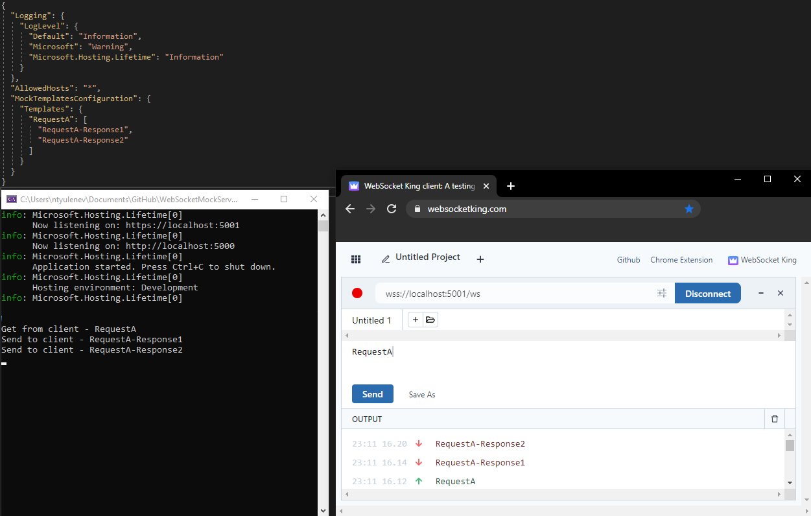

# WebSocketMockServer

### Service that helps frontend team test web socket integration when backend is not ready.

First version with simple request/response data from appsettings.

```
"MockTemplatesConfiguration": {
    "Templates": {
      "RequestA": [
        "RequestA-Response1",
        "RequestA-Response2"
      ]
    }
```

### Example


