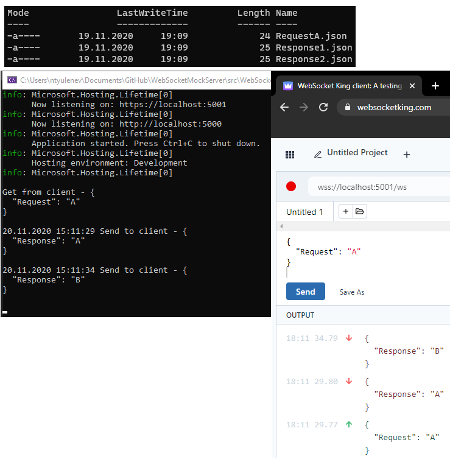

# WebSocketMockServer

### Tool that helps frontend team to test web socket integration when backend is not ready.

Project allows to add multiple responses for one request (with delay if needed).

Current version supports only JSON communication.

### Configuration with request-response mapping
```yaml
"FileLoaderConfiguration": {
  "Folder": "Files",
  "Mapping": [
    {
      "File": "RequestA.json",
      "Responses": [
        { 
          "File": "Response1.json" 
        },
        {
          "File": "Response2.json",
          "Delay": "5000"
        }
      ]
    }
  ]
}
```

### RequestA.json

```yaml
{
  "Request": "A"
}
```

### Response1.json

```yaml
{
  "Response": "A"
}
```

### Response2.json

```yaml
{
  "Response": "B"
}
```

### Example



### Plan to add
* Add unit and integration tests
