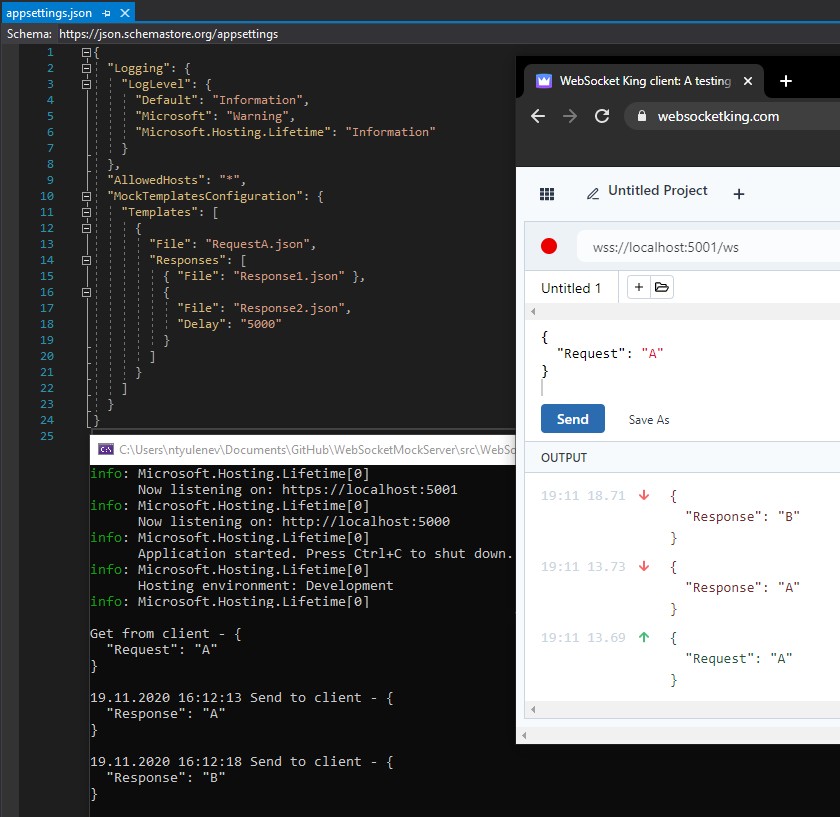

# WebSocketMockServer

### Service that helps frontend team test web socket integration when backend is not ready.

First version with simple request/response data from appsettings.
Supports delayed notifications.

```
"MockTemplatesConfiguration": {
  "Templates": [
    {
      "File": "RequestA.json",
      "Responses": [
        { "File": "Response1.json" },
        {
          "File": "Response2.json",
          "Delay": "5000"
        }
      ]
    }
  ]
}
```

### RequestA.json

```
{
  "Request": "A"
}
```

### Response1.json

```
{
  "Response": "A"
}
```

### Response2.json

```
{
  "Response": "B"
}
```

### Example



### Plan to add
* Refactor files logic
* Add unit tests
