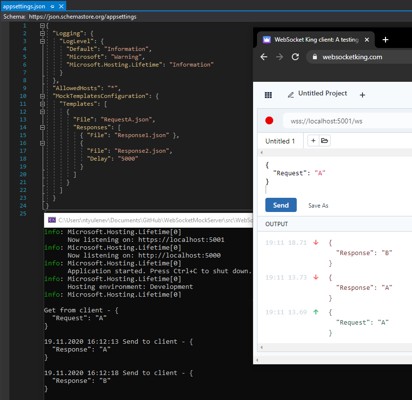

# WebSocketMockServer
Service that helps frontend team to test web socket integration when backend is not ready with predefined request/responses.

First version simple request/response data from appsettings.

App config contains section to add default mock request/responses.

```
"MockTemplatesConfiguration": {
    "Templates": {
      "RequestA": [
        "RequestA-Response1",
        "RequestA-Response2"
      ]
    }
```

